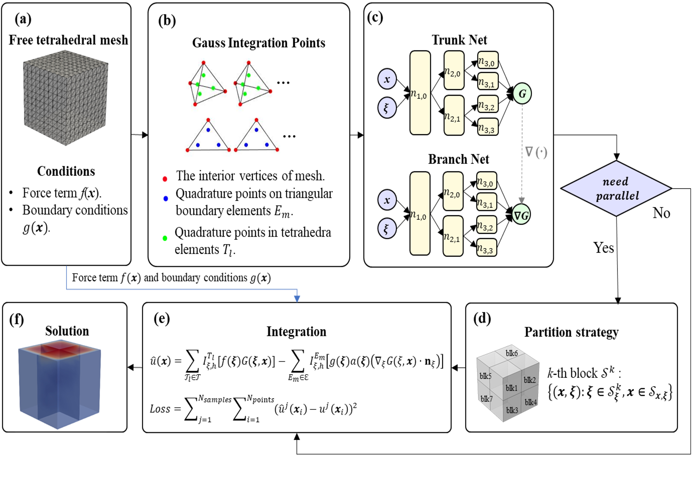

# GreensONet
This repository provides the PaddlePaddle code and data for following research papers:  
Jianghang Gu, Ling Wen, Yuntian Chen, and Shiyi Chen, An explainable operator approximation framework under the guideline of Green's function.


# Framework
The framework of GON:

(a) Import user-defined free tetrahedral mesh and user-defined physical conditions;

(b) Calculate the locations of Gauss integration points and integration weights; 

(c) Constructions of the Trunk Net and Branch Net of the GreensONet based on binary structured neural networks; 

(d) Domain partition and parallel computation strategy; 

(e) Volterra integration based on acquired Green's function; 

(f) The calculated solutions. 




# Installation
```
conda create -n GreensONet python=3.10 # Create a Python 3 virtual environment with conda.
conda activate GreensONet # Activate the virtual environment
pip install -r requirements.txt
pip install -r requirements.txt -i https://pypi.tuna.tsinghua.edu.cn/simple
```

# Download Data and Pretrained Checkpoints

PaddleScience (Recommend)
```
mkdir data
cd data
wget https://dataset.bj.bcebos.com/PaddleScience/PaddleCFD/GON_dataset.tar
tar -xvf GON_dataset.tar
cd ..
wget https://dataset.bj.bcebos.com/PaddleScience/PaddleCFD/ckpt.tar
tar -xvf ckpt.tar
```

Google Drive:

[data](https://drive.google.com/file/d/1lv0WuWCrZsB2MZcaMDFRn06HsxGLgNaq/view?usp=sharing)

[pretrain checkpoint](https://drive.google.com/file/d/122U51gwpriZyQKg6WPCaSXCYX8DzOAIV/view?usp=sharing)

# Test
```
python Inference.py
```

# Train
```
cd GreenONet
chmod 777 -R run.sh
./run.sh
```

# Reference

(1) https://github.com/hangjianggu/Discover_Green_function/tree/main

(2) https://github.com/sloooWTYK/GF-Net/tree/main

(3) https://greenlearning.readthedocs.io/en/latest/guide/installation.html
